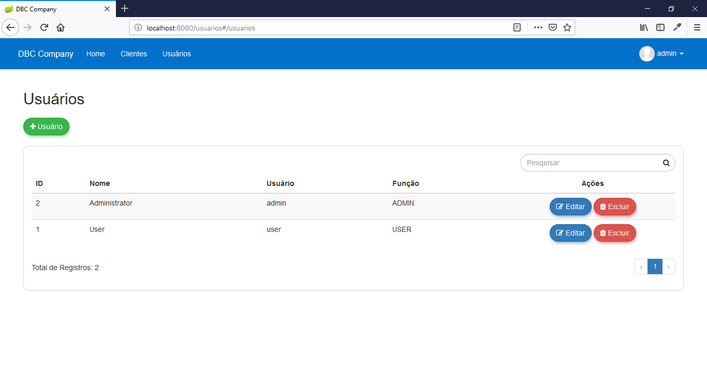
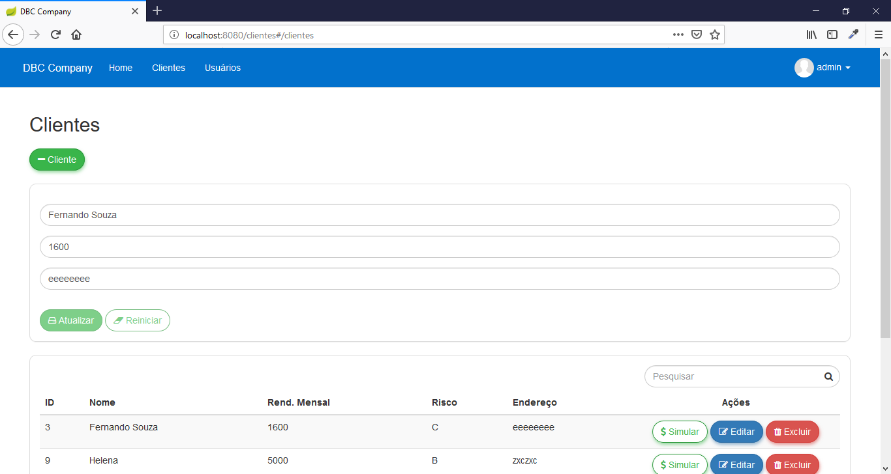
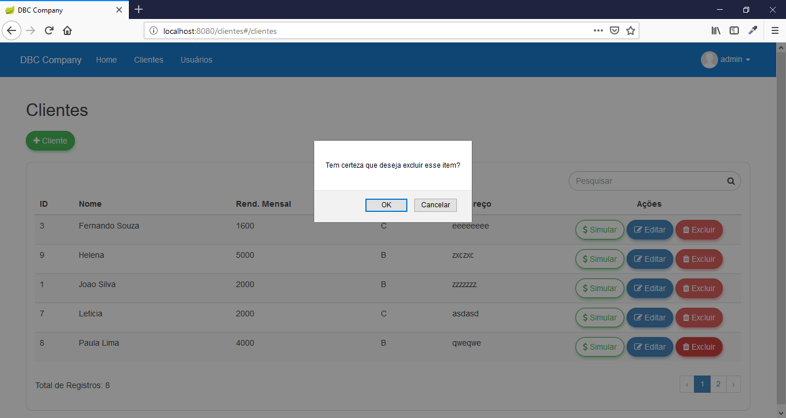
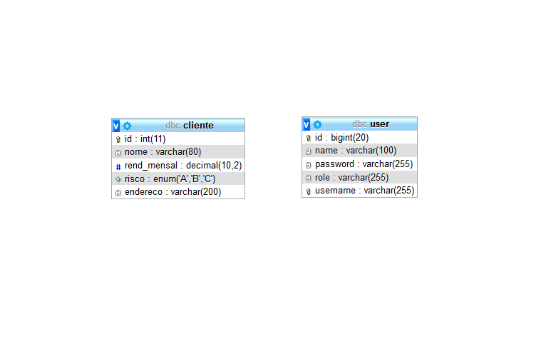

# Simulador de Empréstimo

Projeto de um simulador de empréstimo para clientes, desenvolvido em Java com Spring-Boot.

## Características

- CRUD
- ACL
- Validation
- Login
- Responsive

## Requisitos

- NetBeans 8.2
- Java JDK 1.8
- Apache Tomcat >= 9
- MySql >=5

## Tecnologias

- Java
- JPA
- Maven
- Spring
- CSS
- Bootstrap
- Jquery
- Angular
- MySql

## Instalação

```
$ git clone https://github.com/danilomeneghel/angularjs-spring-boot.git

$ cd angularjs-spring-boot

```

Crie um banco de dados com o nome "dbc" no seu Mysql. Você encontra o dump na raiz do projeto (dbc.sql) e pode efetuar importação da seguinte forma:

```
$ mysql -u <your user> -p <your password>

mysql> create database `dbc`;

mysql> use `dbc`;

mysql> source dbc.sql

```

Depois abra o arquivo "src/main/resources/application.properties" e coloque os dados de acordo com a conexão do seu banco de dados. <br>

Ao concluir a configuração, basta digitar no terminal "mvn spring-boot:run" e abrir no seu navegador o seguinte endereço: <br>

http://localhost:8080/

## Login
	- Username: admin
	- Password: admin

## Licença

User Registration is licensed under <a href="LICENSE">The MIT License (MIT)</a>.

## Screenshots

<br><br>
<br><br>
<br><br>
<br><br>
<br><br>
<br><br>
<br><br>
<br><br>

## Model ER

<br><br>


Developed by<br>
Danilo Meneghel<br>
danilo.meneghel@gmail.com<br>
http://danilomeneghel.github.io/<br>
